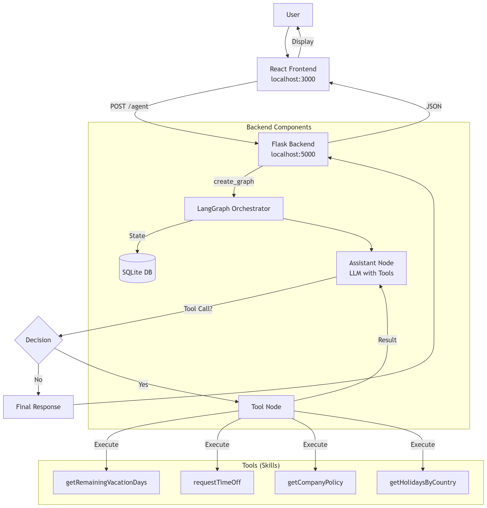
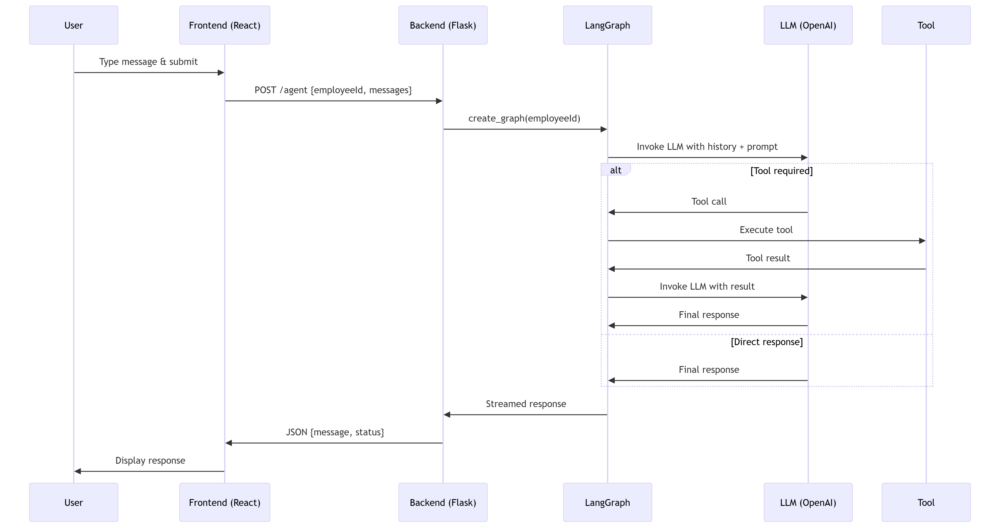

# System Architecture Documentation

## Overview

This document describes the current implementation of the AI agent system, based on the actual codebase. It covers the end-to-end flow, session and state management, tool design, ambiguity handling, key tradeoffs, and current limitations.

---

## 1. Component Descriptions

### 1.1 Frontend (React UI)
- **Role:** Provides the user interface for interaction.
- **Technology:** React.js (as per `frontend/src/App.jsx`).
- **Interaction:** Communicates with the backend Flask API via POST requests to `/agent`.

### 1.2 Backend (Flask API)
- **Role:** Serves as the HTTP layer that receives user messages and orchestrates the agent.
- **Technology:** Python Flask (`backend/api/api_agent.py`).
- **Key Endpoints:**
  - `POST /agent`: Accepts JSON with `employeeId` and `messages`, invokes the agent graph, and returns the response.
  - `GET /healthcheck`: Simple health check.

### 1.3 Agent Orchestrator (LangGraph)
- **Role:** Core reasoning and workflow engine built with LangGraph.
- **Implementation:** `backend/workflow/orchestrator.py` defines a state graph that alternates between an LLM assistant node and a tool‑execution node.
- **Components:**
  - **State:** `MessagesState` (from LangGraph) holds the conversation history.
  - **Assistant Node:** Calls the LLM (OpenAI) bound with tools; the LLM decides whether to use a tool or respond directly.
  - **Tool Node:** Executes the selected tool from the registered toolset.
  - **Conditional Edges:** The graph uses `tools_condition` to route control: if the LLM output contains a tool call, go to the tool node; otherwise, end the turn.

### 1.4 LLM Client & Tool Binding
- **Role:** Provides the LLM instance and binds the available tools.
- **Implementation:** `backend/llm_clients/clients.py`.
- **LLM:** `ChatOpenAI` (model from environment variable `MODEL`).
- **Tools:** Four Python functions imported from `backend.tools.skills`:
  - `getRemainingVacationDays`
  - `requestTimeOff`
  - `getCompanyPolicy`
  - `getHolidaysByCountry` – This tool was added to address a common pain point for remote employees across Latin America: uncertainty about which days are official holidays based on their location or their customers' locations. It helps employees plan their time off and align with local holiday calendars.

### 1.5 Tools (Skills)
- **Role:** Modular Python functions that perform specific HR‑related tasks.
- **Implementation:** `backend/tools/skills.py`.
- **Design:** Each tool has a docstring describing its purpose, parameters, and return value. Tools are stateless and rely only on their inputs.

### 1.6 Memory & Conversation History
- **Role:** Persists conversation state across turns.
- **Implementation:** `SqliteSaver` from LangGraph, connected to a SQLite database (`data/example.db`).
- **Configuration:** The checkpointer is attached to the graph, keyed by `thread_id`. Each user session is identified by a thread ID (currently hard‑coded to "1").

### 1.7 Prompt & System Instructions
- **Role:** Defines the agent’s behavior, constraints, and language rules.
- **Implementation:** `backend/utils/prompts.py` contains a single `PROMPT` string.
- **Key Rules:** The agent must use tools, respect privacy (never disclose employee info), and respond in the same language as the user (English or Spanish).

---

## 2. End-to-End Flow

1. **User Input:** User types a message in the React UI.
2. **Frontend → Backend:** The UI sends a POST request to `http://localhost:5000/agent` with JSON payload:
   ```json
   {
     "employeeId": 1234,
     "messages": [{"role": "user", "content": "..."}]
   }
   ```
3. **Backend Processing:** `api_agent.py` extracts the last user message, creates a `HumanMessage`, and initializes the LangGraph with `create_graph(employee_id)`.
4. **Graph Execution:** The graph streams events:
   - The assistant node invokes the LLM with the system prompt and conversation history.
   - If the LLM decides to call a tool, the graph routes to the tool node, executes the tool, and returns to the assistant node.
   - This loop continues until the LLM returns a final response (no tool calls).
5. **Response Generation:** The final LLM response is extracted from the graph stream.
6. **Backend → Frontend:** The API returns a JSON response containing the message content.
7. **Frontend Display:** The UI displays the response to the user.

---

## 3. Session‑Level State and Conversation History Management

- **State Representation:** The graph state is a `MessagesState` that holds a list of `HumanMessage`, `AIMessage`, and `SystemMessage` objects.
- **Persistence:** `SqliteSaver` writes the state to a SQLite database after each graph step. The database connection is defined in `backend/memory/messages.py`.
- **Session Identification:** Each conversation is identified by a `thread_id` (currently hard‑coded to "1" in both API and main). In a production scenario, the `thread_id` would be derived from a user or session identifier.
- **Memory Scope:** The entire message history is passed to the LLM on each turn, enabling context‑aware responses.

---

## 4. Tool Design and Selection Criteria

- **Tool Definition:** Each tool is a plain Python function with a descriptive docstring. The function signature and docstring are used by LangChain to generate a tool schema for the LLM.
- **Tool Binding:** Tools are listed in `clients.py` and bound to the LLM via `llm.bind_tools(tools)`. The LLM uses these schemas to decide when and how to call a tool.
- **Selection Criteria:** The LLM chooses a tool based on:
  - **Intent Matching:** The user’s request is matched to a tool’s capability (e.g., “How many vacation days do I have?” → `getRemainingVacationDays`).
  - **Parameter Extraction:** The LLM extracts required parameters from the user message (e.g., `employeeId`, `startDate`, `endDate`).
  - **Fallback:** If no tool is appropriate, the LLM responds directly, guided by the prompt to indicate the topics it can help with.

---

## 5. Ambiguity Handling and Clarification Strategy

- **LLM‑Driven Detection:** The LLM is instructed (via the system prompt) to use tools only when the request is clear and within its domain. If the request is ambiguous or lacks required parameters, the LLM will ask for clarification in its response.
- **Tool‑Level Validation:** Some tools include validation logic (e.g., `requestTimeOff` checks that dates are in the future). If validation fails, the tool returns an error message, which is fed back to the LLM so it can adjust its response.
- **Language Handling:** The prompt mandates that the agent respond in the same language as the user (English or Spanish), reducing ambiguity in multilingual contexts.

---

## 6. Key Tradeoffs

- **Cost vs Latency:** Using a state‑of‑the‑art LLM (OpenAI) per turn incurs API cost and adds latency. The graph’s iterative tool‑calling can multiply this cost. Tradeoff: cheaper, faster models could be used but might reduce reasoning quality.
- **Simplicity vs Robustness:** The current design is simple and modular, but error handling is minimal. For example, tool failures are not gracefully recovered. Tradeoff: adding comprehensive error handling would increase complexity.
- **Rules vs LLM Flexibility:** The system relies heavily on the LLM to follow the prompt rules (e.g., privacy, language). There is no hard‑coded enforcement beyond the prompt. Tradeoff: rule‑based filters could be added for security but would reduce flexibility.

---

## 7. Current Limitations and Technical Risks

1. **Hard‑Coded Session ID:** The `thread_id` is fixed to "1", preventing multiple concurrent users. This limits scalability and personalization.
2. **Stateless Tools:** Tools do not access real HR systems; they return mock data. Integration with actual databases or APIs is required for production.
3. **Error Propagation:** Tool exceptions are not caught at the graph level, which could cause the entire graph to fail.
4. **Prompt Reliance:** Security and privacy depend entirely on the LLM adhering to the prompt. A malicious or confused user might extract sensitive information if the LLM deviates.
5. **Single‑Language Support:** The system only supports English and Spanish; other languages are not handled.
6. **No Authentication/Authorization:** The API does not verify the `employeeId` or protect against unauthorized access.
7. **Scalability:** The SQLite checkpointer may become a bottleneck under high load; a more scalable storage backend would be needed.

---

## 8. Diagram Reference

The architecture is visually summarized in two diagrams:


*Figure 1: Component relationships and data flow between frontend, backend, and agent.*


*Figure 2: Step‑by‑step interaction sequence from user input to agent response.*

These diagrams are included in the project root and should be referenced for a visual understanding of the system.

- **Frontend:** React UI
- **Backend:** Flask API (Python)
- **Agent:** LangGraph orchestration with OpenAI LLM and modular tools
- **Flow:** User → React UI → Flask API → LangGraph (LLM + Tools) → Flask API → React UI → User
